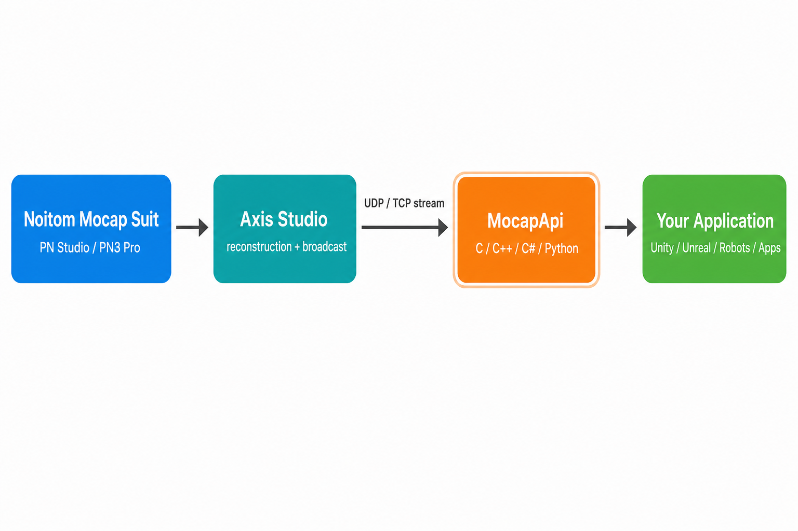

# MocapApi

**MocapApi** is Noitom's next-generation programming interface for consuming real-time
motion-capture data streamed from **Axis Studio** and other Noitom
software. It is the successor to the legacy *NeuronDataReader (NDR)* and was designed
from the ground up to be cross-platform, cross-engine and forward-compatible.

Today MocapApi ships with native **C / C++ / C#** interfaces and a **Python** wrapper,
runs on **Windows / macOS / Linux / Android / iOS**, and integrates directly with
**Unity3D** and **Unreal Engine**.

> Detailed API reference: [English](doc/MocapApi_en.md) · [中文](doc/MocapApi_zh.md)

---

## What is Motion Capture, and where does MocapApi fit?

Motion capture ("mocap") turns the movement of a real performer into digital data that
can drive a 3D character, a robot, or any application that needs live pose information.
Noitom's inertial systems (Perception Neuron Studio, Perception Neuron 3/Pro, etc.)
sense body motion with IMU sensors and reconstruct a skeleton in the capture software.

MocapApi is the **data-access layer** between that software and your application. It does
**not** talk to hardware directly and it does **not** do reconstruction — instead it
receives the outgoing UDP/TCP socket stream produced by the capture software and exposes
it to your code as clean, typed, ready-to-use objects.



In this chain MocapApi is the piece **you program against**. The capture software owns
the sensors and the solver; MocapApi hands you the resulting skeleton, rigid bodies,
raw sensor readings and system events every frame.

---

## Language & Platform Support

| Language | Header / Module                              | Notes                                                                    |
| -------- | -------------------------------------------- | ------------------------------------------------------------------------ |
| C++      | `include/MocapApi.h`                         | Uses the `IMCPXxx` virtual interfaces.                                   |
| C        | `include/MocapCApi.h`                        | Uses the matching `MCPXxx_ProcTable` function-pointer structs.           |
| C#       | `include/MocapApi.cs`                        | Calls `IMCPXxx.Xxx()` static/instance methods directly; no handle types. |
| Python   | [`demo/demo-py`](demo/demo-py)               | Python wrapper and sample over the native library.                       |

Engines: **Unity3D** and **Unreal Engine** (see [`demo/`](demo)).

---

## Core Concepts

MocapApi has a small, consistent object model. Understanding these few concepts is enough
to use the whole API.

### Interfaces (`IMCPXxx`) and Handles (`MCPXxxHandle_t`)

These are the two most important types, and they always work together:

- A **handle** (`MCPXxxHandle_t`, a `uint64_t`) is an *index/identity* of an object that
  MocapApi manages internally. It organizes and tracks data but does **not** grant access
  to the values themselves.
- An **interface** (`IMCPXxx`) is a *stateless accessor*. You pass it a handle and it reads
  the data behind that handle for you.

So the pattern is always: **get an interface once, then call its methods with a handle**.
Interfaces cannot be created directly; you obtain them on demand via `MCPGetGenericInterface`
(C/C++) or the static accessors (C#). C# hides handles entirely.

```cpp
// C++: obtain the interface, then use it with handles
MocapApi::IMCPApplication* app = nullptr;
MocapApi::MCPGetGenericInterface(MocapApi::IMCPApplication_Version,
        reinterpret_cast<void**>(&app));
```

### Data flow: Application → Events → typed objects

- **Application** (`IMCPApplication`) — the top-level object, corresponding to one broadcast
  output port in Axis Studio. You create it, configure it with a **Settings**
  object, `OpenApplication()`, and then **poll it every frame** with
  `PollApplicationNextEvent()` to receive the latest messages.
- **Event** (`MCPEvent_t`) — each poll returns events such as `AvatarUpdated`,
  `RigidBodyUpdated`, `SensorModulesUpdated`, `TrackerUpdated`, `CommandReply` or `Error`.
  Every event carries the handle of the object that was updated, which you then read through
  the matching interface.

### The mocap objects

| Object (interface)                    | Handle                    | What it represents                                                                                                                     |
| ------------------------------------- | ------------------------- | -------------------------------------------------------------------------------------------------------------------------------------- |
| **Avatar** (`IMCPAvatar`)             | `MCPAvatarHandle_t`       | A captured character. Entry point to its skeleton; available when connected to Axis Studio.                                            |
| **Joint** (`IMCPJoint`)               | `MCPJointHandle_t`        | A skeleton node (bone). Provides local rotation/translation; walk the hierarchy from the avatar's root joint. Available with BVH data. |
| **RigidBody** (`IMCPRigidBody`)       | `MCPRigidBodyHandle_t`    | A tracked rigid body (e.g. a prop) with position/rotation/status/id.                                                                   |
| **SensorModule** (`IMCPSensorModule`) | `MCPSensorModuleHandle_t` | Raw per-sensor data: posture (quaternion), angular velocity, acceleration, temperature, etc. Available with Calc data.                 |
| **BodyPart** (`IMCPBodyPart`)         | `MCPBodyPartHandle_t`     | Per-joint Calc description (position, displacement speed, posture). Available with Calc data.                                          |
| **Tracker** (`IMCPTracker`)           | `MCPTrackerHandle_t`      | A device in Alice/AHM; enumerate devices and read their rotation/position/euler angles.                                                |

### Configuration & control objects

| Object (interface)                                          | Purpose                                                                                                                                                   |
| ----------------------------------------------------------- | --------------------------------------------------------------------------------------------------------------------------------------------------------- |
| **Settings** (`IMCPSettings`)                               | Choose the transport (UDP/TCP, ports) and the BVH/Calc data format before opening the application.                                                        |
| **RenderSettings** (`IMCPRenderSettings`)                   | Coordinate conventions: up vector, front vector, coordinate system handedness, rotation direction, unit. Predefined presets exist for Unity3D and Unreal. |
| **Command** (`IMCPCommand`)                                 | Send commands to the server (start/stop capture, calibrate, zero position, record…) and read back result codes/messages.                                  |
| **CalibrateMotionProgress** (`IMCPCalibrateMotionProgress`) | Track multi-pose calibration progress reported by the server.                                                                                             |

### Naming, memory and errors

- **Naming rules** — interfaces are `IMCPXxx`, handles are `MCPXxxHandle_t`; everything else
  follows Hungarian notation.
- **Memory ownership** — *whoever allocates, frees*. If you call a `CreateXxx` you must call
  the matching `DestroyXxx`. Memory returned by `GetXxx` accessors is owned and released by
  MocapApi itself.
- **Error handling** — every function returns an `EMCPError` code. Call errors (bad buffer,
  bad argument) are returned directly; runtime errors (e.g. loss of connection with the
  server) arrive as an `MCPEvent_Error` event.

---

## Typical Usage Flow

1. Get the `IMCPApplication`, `IMCPSettings` (and optionally `IMCPRenderSettings`) interfaces.
2. Create a `Settings` object, set transport (`SetSettingsUDP` / `SetSettingsTCP`) and data
   format (`SetSettingsBvhData` / `SetSettingsCalcData`), then `SetApplicationSettings`.
3. `CreateApplication` → `OpenApplication`.
4. Each frame: `PollApplicationNextEvent`, and for every event read the updated object
   (avatar joints, rigid bodies, sensor modules, trackers…) through its interface.
5. On shutdown: `CloseApplication`, `DestroyApplication`, and destroy any objects you created.

See the [detailed manual](doc/MocapApi_en.md) for the full logic flow chart, every
interface method, all enums and event structures.

---

## Repository Structure

| Path          | Description                                                                          |
| ------------- | ------------------------------------------------------------------------------------ |
| `include/`    | Public headers/bindings: `MocapApi.h` (C++), `MocapCApi.h` (C), `MocapApi.cs` (C#).  |
| `bin/`        | Prebuilt libraries for the supported platforms.                                      |
| `demo/u3d/`   | Unity3D sample project.                                                              |
| `demo/ue4/`   | Unreal Engine sample project.                                                        |
| `demo/wtl/`   | Native C++ (WTL) console/GUI sample.                                                 |
| `doc/`        | Detailed API reference ([English](doc/MocapApi_en.md) · [中文](doc/MocapApi_zh.md)). |
| `install.bat` | Copies the runtime DLL and C# binding into the Unity/Unreal demos.                   |

---

## Run the Demo

1. Run `install.bat` to copy the runtime library and C# binding into the demo projects.
2. Open the demo you want with **Unity3D** (`demo/u3d`) or **Unreal Engine** (`demo/ue4`),
   or build the native sample under `demo/wtl`.
3. In Axis Studio, enable BVH/Calc broadcasting to the machine running the demo
   (use a real LAN IP, not `127.0.0.1`, when connecting from another computer).

---

## Documentation

- API reference (English): [`doc/MocapApi_en.md`](doc/MocapApi_en.md)
- API reference (中文): [`doc/MocapApi_zh.md`](doc/MocapApi_zh.md)

---

## Related Projects & Community Demos

- [**pnmocap/BVH_Viewer**](https://github.com/pnmocap/BVH_Viewer) — a lightweight BVH
  visualization and playback tool (Python) useful for validating skeleton hierarchy,
  joint motion, and exported BVH data.
- [**pnmocap/mocap_ros_py**](https://github.com/pnmocap/mocap_ros_py) — drive ROS robots
  (e.g. Unitree H1/G1) with Noitom motion capture from Python. A great end-to-end example
  of consuming Noitom mocap data downstream.
- [**pnmocap/mocap_ros_cpp**](https://github.com/pnmocap/mocap_ros_cpp) — the C++ counterpart
  of `mocap_ros_py`.

---

## Noitom Hardware and Software

MocapApi mostly connects to Axis Studio software, which is the software working with serveral Noitom hardware products.

### How It Works

```
MocapApi (this repo)
    │
    ├── Receives data FROM → Axis Studio (requires Noitom hardware)
    │
    └── Delivers data TO  → Your application (Isaac Sim, Unity, UE, ROS, etc.)
```

**Noitom hardware** + **Axis Studio** = the data source.  
**MocapApi** = the bridge that delivers that data to your code.

| Stage                | What happens                                                                                                                                           |
| -------------------- | ------------------------------------------------------------------------------------------------------------------------------------------------------ |
| **Sensors**          | Inertial Measurement Units (IMUs) on the body capture orientation, acceleration, and angular velocity                                                  |
| **Transceiver**      | Receives wireless data from all sensors and feeds it to the PC                                                                                         |
| **Axis Studio**      | Noitom's proprietary software — connects to the transceiver, processes raw sensor data into a skeleton, and broadcasts BVH data over the local network |
| **MocapApi**         | A lightweight SDK that listens for the BVH stream from Axis Studio and exposes it as structured joint data to your application                         |
| **Your Application** | Isaac Sim, Unity, Unreal Engine, ROS, or any custom app that consumes the joint data or sensor data                                                    |

**Why can't MocapApi talk to the sensors directly?**  
The sensors output raw IMU data. Converting that into usable joint angles requires sensor fusion algorithms, body modeling, and calibration — all of which are handled by Axis Studio. Think of Axis Studio as the "driver" that turns raw sensor signals into clean, calibrated skeletal motion.

---

### Axis Studio — The Software Bridge

[Axis Studio](https://cdn.noitom.com/download/Axis%20Studio%203%20(Anti-Mag)/Axis_Studio_nacs_x64_3_0_14004_2620_20251222173616363.msi) is Noitom's professional motion capture software. It is the critical link between the hardware sensors and MocapApi.

#### What Axis Studio does

- **Real-time capture** — receives sensor data and renders a live 3D skeleton
- **Calibration** — maps sensors to a human body model via posture calibration
- **BVH Broadcasting** — streams joint data over the local network (UDP) for MocapApi or other SDKs to consume
- **Recording & Export** — saves motion data as FBX, BVH, USD, or raw formats
- **Anti-magnetic processing** — compensates for environmental magnetic interference

#### System Requirements

| Component | Minimum                                    |
| --------- | ------------------------------------------ |
| OS        | Windows 10 / 11 (64-bit)                   |
| RAM       | 4 GB (8 GB recommended)                    |
| GPU       | NVIDIA/AMD with 2 GB+ VRAM, OpenGL 4.4+    |
| USB       | at least 1× USB 3.0 port (for transceiver) |

> For software download, installation, activation, and configuration instructions, visit [support.noitom.com](https://support.noitom.com.cn/s/customer-manual-en/doc/1-software-installation-and-activation-yC49l3MCA2).

---

### Hardware Products

Noitom offers a range of inertial motion capture systems. Every product includes **sensors**, a **transceiver**, and **straps/compression suits**.

#### Product Comparison

|                   | **PN Studio (PNS)**                | **PN 3 **                    | **PN Link**                    |
| ----------------- | ---------------------------------- | ---------------------------- | ------------------------------ |
| **Type**          | Professional wireless IMU          | Entry-level wireless IMU     | Wired IMU                      |
| **Sensors**       | 18 (15.8 g each)                   | 18 (4.1 g each)              | 17 Wired sensors               |
| **Glove support** | ✅                                  | ✅                            | ✅                              |
| **Anti-magnetic** | ✅ (2025 and later)                 | ✅ (2025 and later)           | ✅ (inherent, wired)            |
| **Accuracy**      | Professional grade                 | Good                         | High stability                 |
| **Best for**      | Film, virtual production, research | Animation, games, livestream | Robotics, simulation, research |

#### How data reaches MocapApi

All products follow the same path: sensors connect to a PC → Axis Studio processes the data → BVH is broadcast over the network → MocapApi receives it.

> For robot teleoperation and embodied AI training, **PN Link** is generally recommended due to its wired stability.

---

### Quick Start

Get your first frame of motion data in 8 steps:

```
Step 1   Get hardware        Obtain a Noitom mocap system (sensors + transceiver)
Step 2   Install software    Download & install Axis Studio on a Windows PC
Step 3   Activate            Activate via USB dongle or online activation
Step 4   Connect hardware    Plug in transceiver, charge sensors, attach to body
Step 5   Calibrate           Run T-pose calibration in Axis Studio
Step 6   Enable broadcast    Turn on "BVH Broadcasting" in Axis Studio settings
Step 7   Receive data        Use MocapApi (or any integration) to receive the BVH stream
Step 8   Explore further     Visit support.noitom.com for detailed guides
```

For full instructions on hardware setup, sensor placement, calibration, BVH broadcasting configuration, and troubleshooting, visit 👉 **[support.noitom.com](https://support.noitom.com)**
