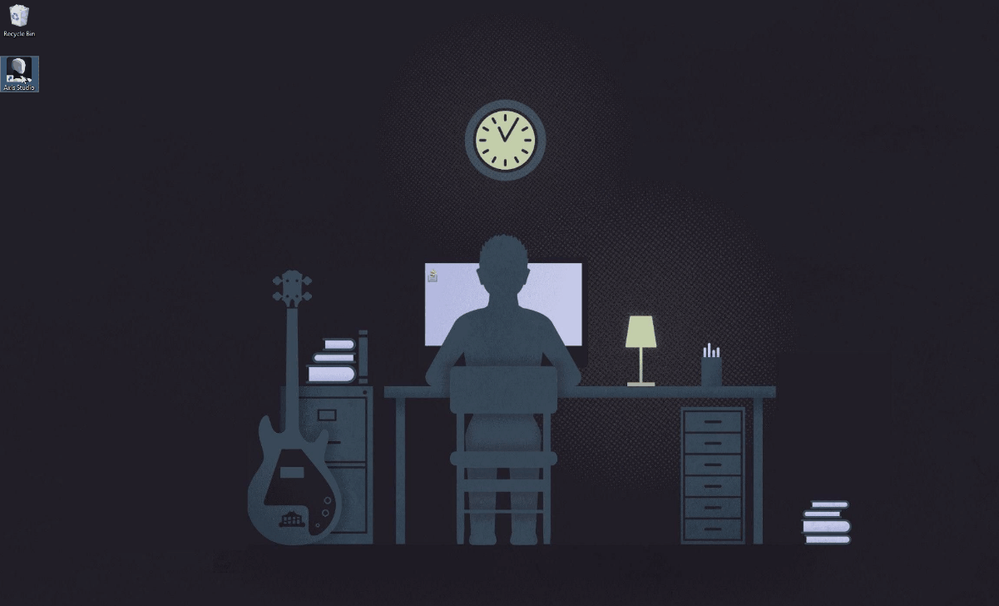
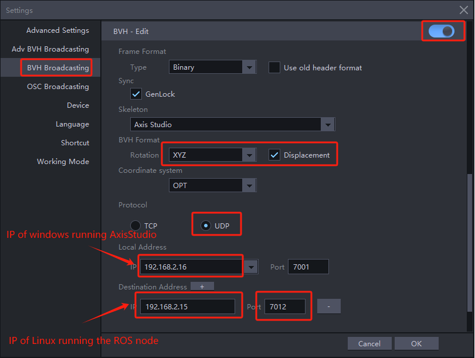

This sample code demonstrates how to obtain Axis Studio data via MocapApi.

# Install and run
```
cd MocapApi
pip install .
cd ..
python mocap_demo.py
```

## Axis Studio

### Launch Axis Studio and open a motion data file

You should see the 3D model moving in Axis Studio, as shown below:



### Configure BVH Broadcasting

Open the settings dialog, select BVH Broadcasting, and enable it:

For Local Address, enter the IP of the Windows PC running Axis Studio. For Destination Address, enter the IP of the Linux PC running the ROS node.

Fill in the remaining red-boxed fields exactly as shown in the figure.



> On the settings page, select “BVH Data Broadcast”. There are two options: BVH-Capture and BVH-Edit. BVH-Capture is for real-time motion data; BVH-Edit is for playback of recorded motion data. For testing, please select BVH-Capture.
